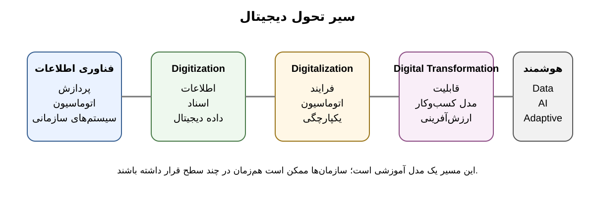

# 1.3 سیر تکامل تحول دیجیتال

**شکل 1-1.** این شکل یک مدل آموزشی از حرکت فناوری اطلاعات از اتوماسیون و دیجیتالی‌سازی تا تحول دیجیتال و تحول دیجیتال هوشمند را نشان می‌دهد. مرزهای این مراحل در سازمان‌های واقعی ممکن است هم‌پوشان باشند.

تحول دیجیتال یک رخداد ناگهانی نیست؛ حاصل چند دهه تغییر تدریجی در نقش فناوری اطلاعات، داده و ارتباطات در سازمان‌هاست. شناخت این مسیر کمک می‌کند بدانیم چرا امروز «تحول دیجیتال هوشمند» به‌عنوان یک مرحله جدید مطرح شده است.

## 1.3.1 از رایانش سازمانی تا دیجیتالی‌شدن

در مرحله نخست، فناوری اطلاعات بیشتر برای پردازش تراکنش‌ها، حسابداری، انبار، منابع انسانی و گزارش‌دهی استفاده می‌شد. هدف غالب، افزایش سرعت، دقت و مقیاس عملیات بود. در این دوره، فناوری اطلاعات بیشتر نقش پشتیبان داشت و مدل اصلی کسب‌وکار عموماً ثابت می‌ماند.

با گسترش اینترنت و سیستم‌های سازمانی، فناوری از یک ابزار داخلی به کانال ارتباطی و عملیاتی تبدیل شد. وب‌سایت‌ها، تجارت الکترونیکی، ERP، CRM و سپس رایانش ابری امکان دادند بخش بزرگ‌تری از ارتباطات و فرایندهای سازمان دیجیتال شوند.

## 1.3.2 از Digitization به Digitalization

**Digitization** را می‌توان تبدیل محتوای آنالوگ یا فیزیکی به داده دیجیتال دانست. هدف در این مرحله عمدتاً تغییر شکل اطلاعات است.

**Digitalization** گامی جلوتر است و از فناوری دیجیتال برای تغییر نحوه اجرای کار استفاده می‌کند. در اینجا هدف، بهبود، یکپارچه‌سازی یا خودکارسازی فرایند است.

برای مثال، اسکن پرونده‌های کاغذی یک اقدام Digitization است؛ اما اگر همان پرونده‌ها در یک گردش‌کار الکترونیکی قرار گیرند، اطلاعات از سامانه‌های مختلف به‌صورت خودکار جمع شوند و تصمیم‌گیری بر اساس قواعد یا تحلیل داده انجام شود، وارد قلمرو Digitalization شده‌ایم.

مرور نظام‌مند ۲۰۲۵ درباره عوامل تحول دیجیتال نیز این دو مفهوم را در کنار Digital Transformation بررسی می‌کند و نشان می‌دهد ادبیات پژوهشی هنوز از اصطلاحات مختلفی استفاده می‌کند؛ بنابراین دانشجو باید در استفاده از آنها دقیق باشد. [3]

## 1.3.3 ظهور Digital Transformation

در تحول دیجیتال، دامنه تغییر از اطلاعات و فرایند فراتر می‌رود و به **قابلیت سازمانی، مدل کسب‌وکار، تجربه مشتری، محصولات و شیوه خلق ارزش** می‌رسد.

کتاب McIvor در ۲۰۲۵ دقیقاً بر همین پیوند میان فناوری و تغییر فرایند، محصول، مدل کسب‌وکار، استراتژی و قابلیت‌های انسانی تأکید دارد. [1]

در این مرحله سازمان دیگر فقط نمی‌پرسد:

«چگونه فرایند موجود را سریع‌تر کنیم؟»

بلکه می‌پرسد:

«آیا اصلاً باید این فرایند را با همین منطق ادامه دهیم؟»

این تغییر سؤال، یکی از نشانه‌های ورود به تحول واقعی است.

## 1.3.4 اقتصاد پلتفرمی و داده‌محوری

رواج پلتفرم‌های دیجیتال باعث شد ارزش‌آفرینی بیش از گذشته به شبکه کاربران، داده، API، نرم‌افزار و اکوسیستم وابسته شود. در این مدل‌ها، سازمان ممکن است بدون مالکیت مستقیم همه دارایی‌های فیزیکی، با ایجاد زیرساخت هماهنگ‌کننده و شبکه‌ای از بازیگران ارزش خلق کند.

در کنار پلتفرم، داده نیز از یک محصول فرعی سیستم‌های اطلاعاتی به یک دارایی راهبردی تبدیل شد. داده امکان مشاهده، تحلیل، پیش‌بینی و شخصی‌سازی را فراهم کرد و به‌تدریج زمینه را برای هوش مصنوعی سازمانی آماده ساخت.

## 1.3.5 ورود هوش مصنوعی مولد و سامانه‌های عامل‌محور

مرحله جدید با رشد Foundation Models، Generative AI و سپس Agentic AI شکل گرفته است. این فناوری‌ها فقط توان پردازش داده را افزایش نمی‌دهند؛ بلکه امکان تعامل طبیعی، تولید محتوا، استدلال، برنامه‌ریزی و در برخی سناریوها اقدام خودکار را نیز افزایش می‌دهند.

مقاله ۲۰۲۶ Kumar و همکاران Agentic AI را نقطه‌ای مهم در تکامل سیستم‌های اطلاعاتی می‌داند، زیرا این سامانه‌ها می‌توانند از اتوماسیون واکنشی به سمت برنامه‌ریزی، هماهنگی و اقدام با سطحی از خودمختاری حرکت کنند. در عین حال، نویسندگان تأکید می‌کنند که چنین خودمختاری پیامدهای اجتماعی–فنی و چالش‌های شفافیت، نظارت، مسئولیت‌پذیری و حکمرانی ایجاد می‌کند. [5]

بنابراین نمی‌توان تحول دیجیتال هوشمند را فقط با اضافه‌کردن یک «لایه AI» تعریف کرد. مسئله، بازطراحی بخشی از سازمان برای زندگی و کار در کنار سیستم‌های هوشمند است.

## 1.3.6 پنج مرحله مفهومی

برای مقاصد آموزشی این کتاب، تکامل را می‌توان به‌صورت زیر خلاصه کرد:

| مرحله | تمرکز اصلی | نمونه سؤال |
|---|---|---|
| فناوری اطلاعات | پردازش و اتوماسیون | چگونه عملیات را سریع‌تر کنیم؟ |
| Digitization | اطلاعات دیجیتال | چگونه اطلاعات را دیجیتال کنیم؟ |
| Digitalization | فرایند | چگونه کار را با فناوری بهتر انجام دهیم؟ |
| Digital Transformation | سازمان و ارزش | چگونه شیوه خلق ارزش را تغییر دهیم؟ |
| Intelligent Digital Transformation | هوش و سازگاری | چگونه سازمانی داده‌محور، هوشمند و تطبیقی بسازیم؟ |

این تقسیم‌بندی یک مدل آموزشی است و نباید آن را یک قانون تاریخی سخت و یکسان برای همه سازمان‌ها تلقی کرد.

### جمع‌بندی

سیر تحول دیجیتال نشان می‌دهد فناوری به‌تدریج از یک ابزار پشتیبان به یکی از عوامل تعیین‌کننده در طراحی سازمان تبدیل شده است. در مرحله جدید، AI به این روند شتاب داده است؛ اما سازمان موفق، سازمانی نیست که بیشترین فناوری را خریداری کند، بلکه سازمانی است که بتواند فناوری را به قابلیت، ارزش و یادگیری سازمانی تبدیل کند.
