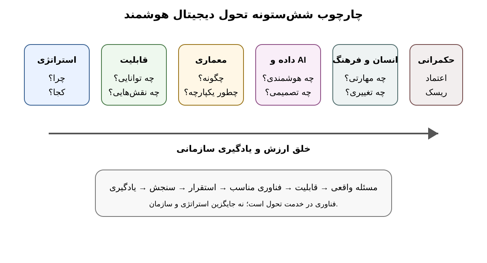

# 1.5 تحول دیجیتال به‌عنوان یک سیستم اجتماعی–فنی

**شکل 1-3.** چارچوب آموزشی شش‌ستونه کتاب برای تحلیل تحول دیجیتال هوشمند. ستون‌ها جدا از هم نیستند و به‌صورت یک سیستم به هم وابسته‌اند.

یکی از مهم‌ترین خطاهای تحلیلی در تحول دیجیتال، تقلیل آن به فناوری است. سازمان یک سیستم اجتماعی–فنی است؛ یعنی عملکرد آن حاصل تعامل فناوری با انسان، فرایند، ساختار، فرهنگ، قوانین و محیط است.

## 1.5.1 چرا فناوری به‌تنهایی کافی نیست؟

فرض کنید یک سازمان یک سامانه هوش مصنوعی برای پاسخ‌گویی به مشتریان خریداری کرده است. از نظر فنی، سامانه می‌تواند پاسخ مناسب تولید کند. اما اگر:

- دانش سازمانی در دسترس سامانه نباشد؛
- داده‌های مشتری ناقص باشند؛
- کارکنان ندانند چه زمانی پاسخ AI را تأیید یا اصلاح کنند؛
- مسئولیت یک پاسخ اشتباه مشخص نباشد؛
- فرایند رسیدگی به شکایت با سامانه هماهنگ نشده باشد؛
- یا مشتری به سیستم اعتماد نکند؛

نمی‌توان گفت سازمان صرفاً به دلیل نصب فناوری متحول شده است.

## 1.5.2 پنج جزء اجتماعی–فنی

برای تحلیل مقدماتی می‌توان پنج جزء را در نظر گرفت:

**فناوری:** سامانه، زیرساخت، الگوریتم و رابط‌ها.

**داده و دانش:** اطلاعات مورد نیاز برای تصمیم و یادگیری.

**فرایند و ساختار:** روش انجام کار، نقش‌ها و مسئولیت‌ها.

**انسان و فرهنگ:** مهارت، انگیزه، اعتماد، نگرش و الگوی همکاری.

**حکمرانی و محیط:** مقررات، امنیت، اخلاق، بازار و ذی‌نفعان.

تحول پایدار زمانی رخ می‌دهد که این اجزا به‌صورت هماهنگ تغییر کنند.

## 1.5.3 چارچوب شش‌ستونه کتاب

برای نگه‌داشتن انسجام کل کتاب، شش ستون زیر به‌عنوان چارچوب آموزشی ثابت استفاده می‌شوند:

1. **استراتژی:** چرا تحول لازم است و چه ارزشی باید ایجاد کند؟
2. **قابلیت سازمانی:** سازمان چه توانایی‌هایی باید بسازد یا تغییر دهد؟
3. **معماری:** اجزای کسب‌وکار، داده، کاربرد و فناوری چگونه هماهنگ شوند؟
4. **داده و AI:** چگونه از داده برای هوشمندی، پیش‌بینی و تصمیم استفاده شود؟
5. **انسان و فرهنگ:** چه مهارت‌ها و تغییرات رفتاری لازم است؟
6. **حکمرانی و اعتماد:** ریسک، امنیت، مسئولیت و انطباق چگونه مدیریت شود؟

این چارچوب یک مدل آموزشی است و ادعای استانداردبودن آن در ادبیات ندارد. مزیت آن ایجاد زبان مشترک برای فصل‌های بعدی است.

## 1.5.4 شواهد پژوهشی جدید

یک مرور نظام‌مند ۲۰۲۵ درباره عوامل تحول دیجیتال نشان می‌دهد که محرک‌های فناوری باید در کنار عوامل سازمانی و فردی دیده شوند. [4] پژوهش دیگری در ۲۰۲۵ که ۱۸۳ انتشار علمی را بررسی کرده است، نقش عامل انسانی را به‌عنوان جزء مستقل و هم‌سطح در موفقیت پروژه‌های تحول مطرح می‌کند. [5]

این نتیجه با یک مرور یکپارچه در *Management Decision* در ۲۰۲۵ نیز هم‌راستا است؛ این مطالعه نقش فناوری‌های شناختی مانند AI و IoT را در کنار عامل انسانی و قابلیت تحول بررسی می‌کند. [6]

## 1.5.5 نمونه آموزشی: بیمارستان

فرض کنید بیمارستانی سامانه پیش‌بینی ریسک بستری مجدد بیماران را ایجاد کرده است. ارزش سامانه فقط به دقت مدل وابسته نیست. باید مشخص باشد:

- چه داده‌هایی وارد مدل می‌شوند؛
- چه پزشکی نتیجه را می‌بیند؛
- چه زمانی مدل حق پیشنهاد دارد؛
- چه زمانی تصمیم پزشک بر مدل مقدم است؛
- خطا چگونه ثبت و بررسی می‌شود؛
- و چگونه نتیجه مدل وارد فرایند درمان می‌شود.

در نتیجه، «مدل AI» فقط یک جزء از یک سیستم اجتماعی–فنی بزرگ‌تر است.

## 1.5.6 پیام برای مدیر تحول

مدیر تحول نباید فقط مدیر فناوری باشد. وظیفه او ایجاد هماهنگی میان فناوری و سازمان است. این هماهنگی شامل تعریف مسئله، ایجاد قابلیت، بازطراحی فرایند، آموزش افراد، مدیریت تغییر و ایجاد سازوکار کنترل است.

### اصل فصل

> **اگر فناوری تغییر کند اما روش کار، نقش افراد، داده، تصمیم‌گیری و سازوکار مسئولیت‌پذیری تغییر نکند، احتمالاً با «نوسازی فناوری» روبه‌رو هستیم، نه تحول کامل سازمان.**
