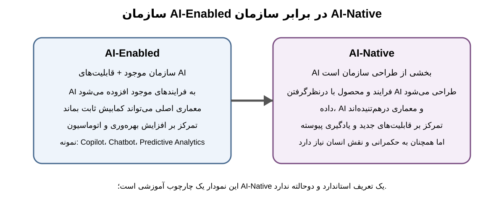

# 1.6 از سازمان دیجیتال تا سازمان AI-Native

**شکل 1-2.** مدل آموزشی این کتاب برای تمایز میان سازمان AI-Enabled و سازمان AI-Native. این مدل یک طبقه‌بندی رسمی نیست؛ برای تحلیل و آموزش به کار می‌رود.

ورود هوش مصنوعی مولد (Generative AI) و سامانه‌های عامل‌محور (Agentic AI) این پرسش را ایجاد کرده است که آیا سازمان‌ها فقط باید هوش مصنوعی را به ابزارها و فرایندهای موجود اضافه کنند، یا باید برخی محصولات، فرایندها و شیوه‌های سازمان‌دهی خود را بر مبنای آن بازطراحی کنند. این پرسش، مرز میان **AI-Enabled** و **AI-Native** را شکل می‌دهد.

## 1.6.1 AI-Enabled یعنی چه؟

در یک سازمان AI-Enabled، ساختار اصلی سازمان می‌تواند همان ساختار قبلی باقی بماند، اما قابلیت‌های هوش مصنوعی به آن افزوده می‌شوند؛ برای مثال، یک دستیار مولد برای کارکنان، یک مدل پیش‌بینی برای تقاضا یا یک سامانه تشخیص ناهنجاری برای تجهیزات.

این رویکرد الزاماً سطح پایینی از بلوغ نیست. بسیاری از سازمان‌ها منطقی است که تحول را از همین نقطه آغاز کنند. ارزش این مرحله زمانی ایجاد می‌شود که استفاده از AI به مسئله واقعی، فرایند مشخص و معیار عملکرد متصل باشد؛ نه اینکه صرفاً به دلیل جدیدبودن فناوری یک ابزار خریداری شود.

## 1.6.2 AI-Native یک مفهوم نوظهور است

**AI-Native Organization** هنوز یک استاندارد رسمی یا یک تعریف دانشگاهی واحد ندارد. پژوهش‌های جدید، آن را بیشتر به سازمان‌هایی نسبت می‌دهند که AI در محصول، فرایند یا منطق سازمان‌دهی آنها نقش بنیادی دارد.

برای نمونه، مطالعه Kim و Koning در سال ۲۰۲۶ درباره شرکت‌های AI-native نشان می‌دهد نمونه‌های بررسی‌شده، در مقایسه با شرکت‌های نوپای هم‌گروه، به‌طور متوسط نیروی انسانی کمتری، سهم مهندسان بیشتری و سلسله‌مراتب تخت‌تری داشته‌اند. نویسندگان این الگو را به دو مسیر نسبت می‌دهند: تغییر در نحوه انجام کار درون سازمان و تعبیه قابلیت AI در محصولی که سازمان عرضه می‌کند. این یافته جالب است، اما به دلیل ماهیت داده و طراحی مطالعه نباید به همه سازمان‌ها تعمیم داده شود. [11]

بنابراین در این کتاب، AI-Native را یک **مفهوم تحلیلی نوظهور** می‌دانیم، نه برچسبی که بتوان با یک آزمون ساده و قطعی به همه سازمان‌ها نسبت داد.

## 1.6.3 تعریف عملیاتی کتاب

برای مقاصد این کتاب، سازمان AI-Native سازمانی است که AI در بخش مهمی از **محصول، عملیات، تصمیم‌گیری یا تعامل با ذی‌نفعان** چنان ادغام شده است که طراحی سازمان بدون درنظرگرفتن قابلیت‌های AI قابل توضیح نیست.

این تعریف سه نکته مهم دارد.

نخست، چند ابزار AI به‌تنهایی سازمان را AI-Native نمی‌کنند. دوم، AI-Native بودن یک ویژگی صفر و یکی نیست و می‌تواند در بخش‌هایی از سازمان بیشتر از بخش‌های دیگر دیده شود. سوم، AI-Native بودن الزاماً به معنای خودمختاری بیشتر یا عملکرد بهتر نیست؛ ارزش آن به مسئله، محیط، ریسک و طراحی سیستم بستگی دارد.

## 1.6.4 از AI-Assisted تا AI-Native؛ یک مدل آموزشی

برای کمک به تحلیل، مسیر زیر را به‌عنوان **مدل آموزشی کتاب** در نظر می‌گیریم:

| سطح | توصیف | پرسش تشخیصی |
|---|---|---|
| AI-Assisted | فرد از AI برای کمک به انجام کار استفاده می‌کند | آیا AI فقط دستیار فرد است؟ |
| AI-Enabled | سازمان قابلیت AI را به فرایند یا محصول موجود اضافه می‌کند | آیا AI یک قابلیت مشخص ایجاد کرده است؟ |
| AI-Integrated | AI در چند فرایند و لایه سازمان به‌صورت هماهنگ ادغام شده است | آیا داده، فرایند، معماری و مهارت‌ها با هم هماهنگ‌اند؟ |
| AI-Native | بخشی از منطق محصول، عملیات یا سازمان از ابتدا یا عمیقاً با AI طراحی شده است | آیا سازمان بدون درنظرگرفتن AI دیگر به همان شکل قابل طراحی نیست؟ |

این سطوح برای آموزش و تشخیص‌اند و نباید به‌عنوان استاندارد رسمی بلوغ معرفی شوند.

## 1.6.5 Agentic AI چه چیزی را تغییر می‌دهد؟

در اتوماسیون کلاسیک، مسیر اجرا عمدتاً از قبل مشخص است. در سامانه‌های Agentic، سیستم می‌تواند در برخی معماری‌ها هدف را دریافت کند، یک برنامه بسازد، ابزارها یا سامانه‌های دیگر را فراخوانی کند، نتیجه را ارزیابی کند و در صورت نیاز مسیر را تغییر دهد.

پژوهش ۲۰۲۶ در *Information & Management*، Agentic AI را به‌عنوان سامانه‌هایی با قابلیت برنامه‌ریزی، استدلال و اقدام با میزان محدودی از نظارت انسانی بررسی می‌کند و در کنار فرصت‌های بهره‌وری، پیامدهایی مانند جابه‌جایی نقش‌های شغلی، شفافیت، حکمرانی و عدالت را مطرح می‌کند. [7]

بنابراین Agentic AI فقط «نسخه قوی‌تر یک chatbot» نیست. وقتی سامانه بتواند از ابزارها استفاده کند و در جریان واقعی کار اقدام انجام دهد، مرز میان نرم‌افزار، فرایند و عامل سازمانی تا حدی جابه‌جا می‌شود.

با این حال، در این فصل وارد طراحی فنی Agent نمی‌شویم. معماری، داده، RAG، انتخاب مدل، ارزیابی، ارکستراسیون و مدیریت چرخه عمر در فصل ۵ و کاربردهای عملیاتی Agent در فصل ۷ بررسی خواهند شد.

## 1.6.6 خودمختاری هدف نهایی نیست

یک سوءبرداشت رایج این است که هرچه خودمختاری AI بیشتر شود، تحول پیشرفته‌تر است. چنین نتیجه‌ای علمی نیست.

در بسیاری از محیط‌ها، از جمله سلامت، خدمات مالی، زیرساخت‌های حیاتی و تصمیم‌های پرریسک، سطح مناسب خودمختاری باید با پیامد خطا، الزامات قانونی، قابلیت نظارت و ارزش تصمیم تنظیم شود. در برخی موارد **Human-in-the-Loop** مناسب است؛ در برخی موارد **Human-on-the-Loop**؛ و در برخی کارهای کم‌ریسک می‌توان خودمختاری بیشتری به سیستم داد.

بنابراین معیار بلوغ، «بیشینه‌کردن استقلال ماشین» نیست. معیار بهتر، **طراحی مناسب تقسیم کار میان انسان و ماشین** است.

## 1.6.7 یک آزمون ساده برای مدیر

برای تشخیص اینکه سازمان فقط AI را اضافه کرده یا واقعاً در حال تغییر است، این پرسش‌ها مفیدند:

1. AI کدام مسئله مهم سازمان را حل می‌کند؟
2. آیا فرایند کار به‌دلیل AI بازطراحی شده است؟
3. آیا داده و دانش سازمانی برای AI قابل استفاده است؟
4. آیا نقش‌ها و مسئولیت‌های انسان و AI مشخص‌اند؟
5. آیا معماری و زیرساخت برای مقیاس‌گذاری آماده‌اند؟
6. آیا ریسک، امنیت و حکمرانی از ابتدا طراحی شده‌اند؟
7. آیا نتیجه در ارزش واقعی کسب‌وکار یا خدمت عمومی دیده می‌شود؟

اگر پاسخ به بیشتر این پرسش‌ها منفی باشد، سازمان احتمالاً هنوز در مرحله آزمایش یا AI-Assisted/AI-Enabled قرار دارد.

### جمع‌بندی آموزشی

AI-Native را نباید یک مد بازاری یا یک جایزه بلوغ دانست. این اصطلاح برای توصیف سازمان‌هایی مفید است که طراحی آنها به‌طور عمیق با قابلیت‌های AI درهم‌تنیده است. در مقابل، Agentic AI مرز تازه‌ای برای اتوماسیون و طراحی سازمان ایجاد می‌کند، اما هنوز حوزه‌ای نوظهور است و باید همراه با ارزیابی ریسک، حکمرانی و شواهد تجربی دنبال شود.
